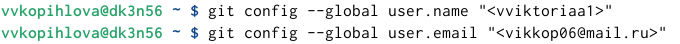

---
## Front matter
title: "отчет по лабораторной работе №2"
subtitle: "Архитектура компьютера"
author: "Копылова Виктория Валерьевна"

## Generic otions
lang: ru-RU
toc-title: "Содержание"

## Bibliography
bibliography: bib/cite.bib
csl: pandoc/csl/gost-r-7-0-5-2008-numeric.csl

## Pdf output format
toc: true # Table of contents
toc-depth: 2
lof: true # List of figures
lot: true # List of tables
fontsize: 12pt
linestretch: 1.5
papersize: a4
documentclass: scrreprt
## I18n polyglossia
polyglossia-lang:
  name: russian
  options:
	- spelling=modern
	- babelshorthands=true
polyglossia-otherlangs:
  name: english
## I18n babel
babel-lang: russian
babel-otherlangs: english
## Fonts
mainfont: IBM Plex Serif
romanfont: IBM Plex Serif
sansfont: IBM Plex Sans
monofont: IBM Plex Mono
mathfont: STIX Two Math
mainfontoptions: Ligatures=Common,Ligatures=TeX,Scale=0.94
romanfontoptions: Ligatures=Common,Ligatures=TeX,Scale=0.94
sansfontoptions: Ligatures=Common,Ligatures=TeX,Scale=MatchLowercase,Scale=0.94
monofontoptions: Scale=MatchLowercase,Scale=0.94,FakeStretch=0.9
mathfontoptions:
## Biblatex
biblatex: true
biblio-style: "gost-numeric"
biblatexoptions:
  - parentracker=true
  - backend=biber
  - hyperref=auto
  - language=auto
  - autolang=other*
  - citestyle=gost-numeric
## Pandoc-crossref LaTeX customization
figureTitle: "Рис."
tableTitle: "Таблица"
listingTitle: "Листинг"
lofTitle: "Список иллюстраций"
lotTitle: "Список таблиц"
lolTitle: "Листинги"
## Misc options
indent: true
header-includes:
  - \usepackage{indentfirst}
  - \usepackage{float} # keep figures where there are in the text
  - \floatplacement{figure}{H} # keep figures where there are in the text
---

# Цель работы

Целью работы является изучить идеологию и применение средств контроля версий. При-
обрести практические навыки по работе с системой git.

# Задание

1. В соответствующем каталоге сделайте отчёт по лабораторной работе № 2 в формате
Markdown. В качестве отчёта необходимо предоставить отчёты в 3 форматах: pdf, docx
и md.
2. Загрузите файлы на github

# Теоретическое введение

Здесь описываются теоретические аспекты, связанные с выполнением работы.

Например, в табл. [-@tbl:std-dir] приведено краткое описание стандартных каталогов Unix.

: Описание некоторых каталогов файловой системы GNU Linux {#tbl:std-dir}

| Имя каталога | Описание каталога                                                                                                          |
|--------------|----------------------------------------------------------------------------------------------------------------------------|
| `/`          | Корневая директория, содержащая всю файловую                                                                               |
| `/bin `      | Основные системные утилиты, необходимые как в однопользовательском режиме, так и при обычной работе всем пользователям     |
| `/etc`       | Общесистемные конфигурационные файлы и файлы конфигурации установленных программ                                           |
| `/home`      | Содержит домашние директории пользователей, которые, в свою очередь, содержат персональные настройки и данные пользователя |
| `/media`     | Точки монтирования для сменных носителей                                                                                   |
| `/root`      | Домашняя директория пользователя  `root`                                                                                   |
| `/tmp`       | Временные файлы                                                                                                            |
| `/usr`       | Вторичная иерархия для данных пользователя                                                                                 |

Более подробно про Unix см. в [@tanenbaum_book_modern-os_ru; @robbins_book_bash_en; @zarrelli_book_mastering-bash_en; @newham_book_learning-bash_en].

# Выполнение лабораторной работы

2.4.1. Настройка github
Создаем учётную запись на сайте https://github.com/ и заполняем основные данные.

2.4.2. Базовая настройка git
Сначала сделаем предварительную конфигурацию git. Откроем терминал и введем следующие команды, указав имя и email владельца репозитория [-@fig:001] :

{ width=100% }

Настроим utf-8 в выводе сообщений git [-@fig:002] :

{ width=100% }

Зададим имя начальной ветки (будем называть её master) [-@fig:003] :

{ width=100% }

Параметр autocrlf [-@fig:004] :

{ width=100% }

Параметр safecrlf [-@fig:005] :

{ width=100% }

2.4.3. Создание SSH ключа
Для последующей идентификации пользователя на сервере репозиториев необходимо сгенерировать пару ключей (приватный и открытый) [-@fig:006] Далее необходимо загрузить сгенерённый открытый ключ. Для этого зайти на сайт http: //github.org/ под своей учётной записью и перейти в меню Setting . После этого выбрать в боковом меню SSH and GPG keys и нажать кнопку New SSH key . Скопировав из локальной консоли ключ в буфер обмена  [-@fig:006] :

{ width=100% }

Вставляем ключ в появившееся на сайте поле и указываем для ключа имя (Title) [-@fig:007] :

{ width=100% }

2.4.4. Создание рабочего пространства и репозитория курса на основе шаблона
Откроем терминал и создадим каталог для предмета «Архитектура компьютера» [-@fig:008] :

{ width=100% }

2.4.5. Создание репозитория курса на основе шаблона

Откроем терминал и перейдем в каталог курса [-@fig:009] :

{ width=100% }

Клонируем созданный репозиторий [-@fig:010] :

{ width=100% }

2.4.6. Настройка каталога курса
Перейдем в каталог курса [-@fig:011] :

{ width=100% }

Удалим лишние файлы [-@fig:012] :

{ width=100% }

Создадим необходимые каталоги [-@fig:013] , [-@fig:014] , [-@fig:015] , [-@fig:016] , [-@fig:017] , [-@fig:018] , [-@fig:019] :

{ width=100% }

{ width=100% }

{ width=100% }

{ width=100% }

{ width=100% }

{ width=100% }

{ width=100% }

Отправляем файлы на сервер [-@fig:020] :

{ width=100% }

Проверим правильность создания иерархии рабочего пространства в локальном репозитории и на странице github [-@fig:021] , [-@fig:022] :

{ width=100% }

{ width=100% }

# Выводы

 Я изучила идеологию и применение средств контроля версий. Приобрела практические навыки по работе с системой git.

# Список литературы{.unnumbered}

::: {#refs}
:::
