---
## Front matter
title: "Отчёт по лабораторной работе №5"
subtitle: "Архитектура компьютера"
author: "Копылова Виктория Валерьевна"

## Generic otions
lang: ru-RU
toc-title: "Содержание"

## Bibliography
bibliography: bib/cite.bib
csl: pandoc/csl/gost-r-7-0-5-2008-numeric.csl

## Pdf output format
toc: true # Table of contents
toc-depth: 2
lof: true # List of figures
lot: true # List of tables
fontsize: 12pt
linestretch: 1.5
papersize: a4
documentclass: scrreprt
## I18n polyglossia
polyglossia-lang:
  name: russian
  options:
	- spelling=modern
	- babelshorthands=true
polyglossia-otherlangs:
  name: english
## I18n babel
babel-lang: russian
babel-otherlangs: english
## Fonts
mainfont: IBM Plex Serif
romanfont: IBM Plex Serif
sansfont: IBM Plex Sans
monofont: IBM Plex Mono
mathfont: STIX Two Math
mainfontoptions: Ligatures=Common,Ligatures=TeX,Scale=0.94
romanfontoptions: Ligatures=Common,Ligatures=TeX,Scale=0.94
sansfontoptions: Ligatures=Common,Ligatures=TeX,Scale=MatchLowercase,Scale=0.94
monofontoptions: Scale=MatchLowercase,Scale=0.94,FakeStretch=0.9
mathfontoptions:
## Biblatex
biblatex: true
biblio-style: "gost-numeric"
biblatexoptions:
  - parentracker=true
  - backend=biber
  - hyperref=auto
  - language=auto
  - autolang=other*
  - citestyle=gost-numeric
## Pandoc-crossref LaTeX customization
figureTitle: "Рис."
tableTitle: "Таблица"
listingTitle: "Листинг"
lofTitle: "Список иллюстраций"
lotTitle: "Список таблиц"
lolTitle: "Листинги"
## Misc options
indent: true
header-includes:
  - \usepackage{indentfirst}
  - \usepackage{float} # keep figures where there are in the text
  - \floatplacement{figure}{H} # keep figures where there are in the text
---

# Цель работы

Приобретение практических навыков работы в Midnight Commander. Освоение инструкций языка ассемблера mov и int.

# Задание

1. Создайте копию файла lab5-1.asm. Внесите изменения в программу (без использова-
ния внешнего файла in_out.asm), так чтобы она работала по следующему алгоритму:
• вывести приглашение типа “Введите строку:”;
• ввести строку с клавиатуры;
• вывести введённую строку на экран.
2. Получите исполняемый файл и проверьте его работу. На приглашение ввести строку
введите свою фамилию.
3. Создайте копию файла lab5-2.asm. Исправьте текст программы с использование под-
программ из внешнего файла in_out.asm, так чтобы она работала по следующему
алгоритму:
• вывести приглашение типа “Введите строку:”;
• ввести строку с клавиатуры;
• вывести введённую строку на экран

# Теоретическое введение

Здесь описываются теоретические аспекты, связанные с выполнением работы.

Например, в табл. [-@tbl:std-dir] приведено краткое описание стандартных каталогов Unix.

: Описание некоторых каталогов файловой системы GNU Linux {#tbl:std-dir}

| Имя каталога | Описание каталога                                                                                                          |
|--------------|----------------------------------------------------------------------------------------------------------------------------|
| `/`          | Корневая директория, содержащая всю файловую                                                                               |
| `/bin `      | Основные системные утилиты, необходимые как в однопользовательском режиме, так и при обычной работе всем пользователям     |
| `/etc`       | Общесистемные конфигурационные файлы и файлы конфигурации установленных программ                                           |
| `/home`      | Содержит домашние директории пользователей, которые, в свою очередь, содержат персональные настройки и данные пользователя |
| `/media`     | Точки монтирования для сменных носителей                                                                                   |
| `/root`      | Домашняя директория пользователя  `root`                                                                                   |
| `/tmp`       | Временные файлы                                                                                                            |
| `/usr`       | Вторичная иерархия для данных пользователя                                                                                 |

Более подробно про Unix см. в [@tanenbaum_book_modern-os_ru; @robbins_book_bash_en; @zarrelli_book_mastering-bash_en; @newham_book_learning-bash_en].

# Выполнение лабораторной работы

1. Откройте Midnight Commander (рис. 1 [-@fig:001]).

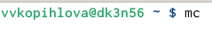{width=100%}

2. Пользуясь клавишами ↑ , ↓ и Enter перейдите в каталог ~/work/arch-pc созданный при выполнении лабораторной работы №4 (рис. 2 [-@fig:002]).

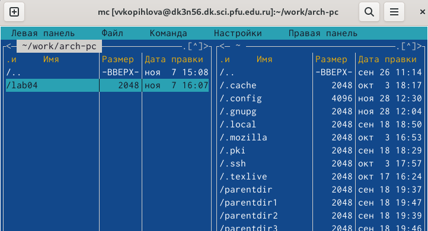{width=100%}

3. С помощью функциональной клавиши F7 создайте папку lab05 и перейдите в созданный каталог (рис. 3 [-@fig:003]).

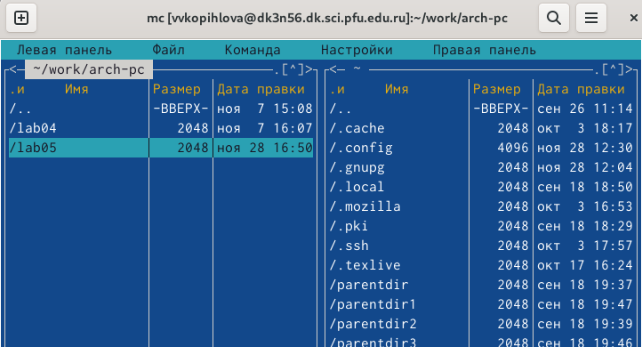{width=100%}

4. Пользуясь строкой ввода и командой touch создайте файл lab5-1.asm (рис. 4 [-@fig:004]).

{width=100%}

5. С помощью функциональной клавиши F4 откройте файл lab5-1.asm для редактирования во встроенном редакторе.
6. Введите текст программы из листинга 5.1 (можно без комментариев), сохраните изменения и закройте файл (рис. 5 [-@fig:005]).

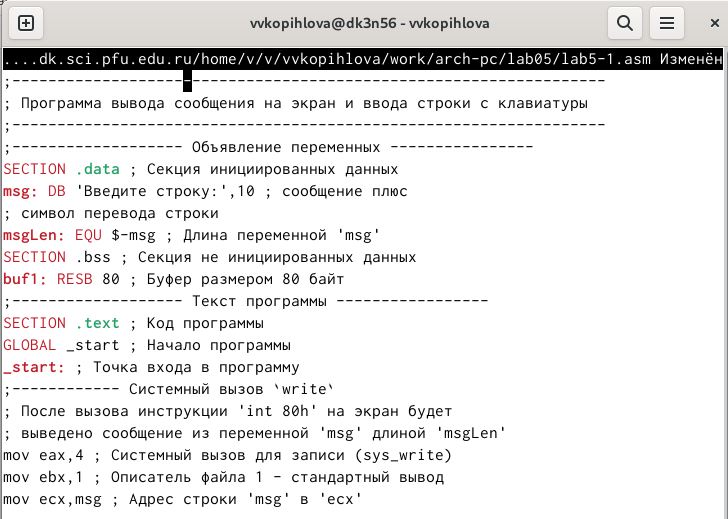{width=100%}

7. С помощью функциональной клавиши F3 откройте файл lab5-1.asm для просмотра. Убедитесь, что файл содержит текст программы (рис. 6 [-@fig:006]).

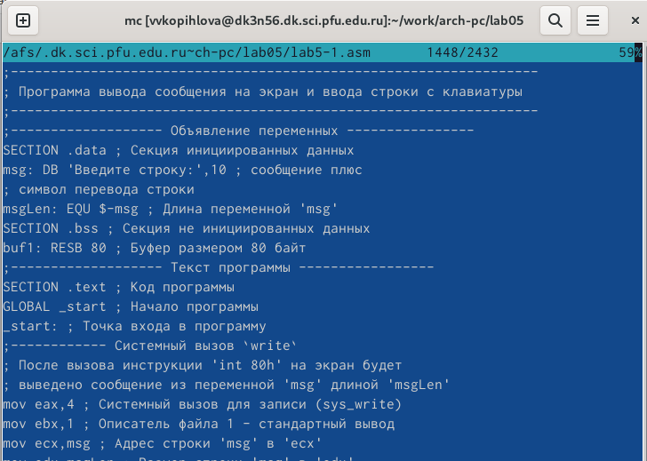{width=100%}

8. Оттранслируйте текст программы lab5-1.asm в объектный файл. Выполните компоновку объектного файла и запустите получившийся исполняемый файл (рис. 7 [-@fig:007]).

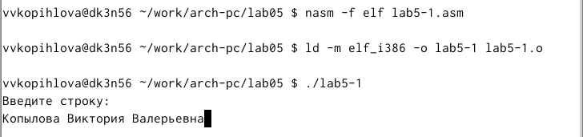{width=100%}

9. Скачайте файл in_out.asm со страницы курса в ТУИС
10. Подключаемый файл in_out.asm должен лежать в том же каталоге, что и файл с программой, в которой он используется (рис. 8 [-@fig:008]).

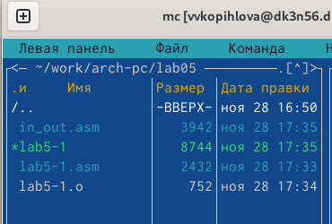{width=100%}

11. С помощью функциональной клавиши F6 создайте копию файла lab5-1.asm с именем lab5-2.asm. Выделите файл lab5-1.asm, нажмите клавишу F6 , введите имя файла lab5-2.asm и нажмите клавишу Enter (рис. 9 [-@fig:009]).

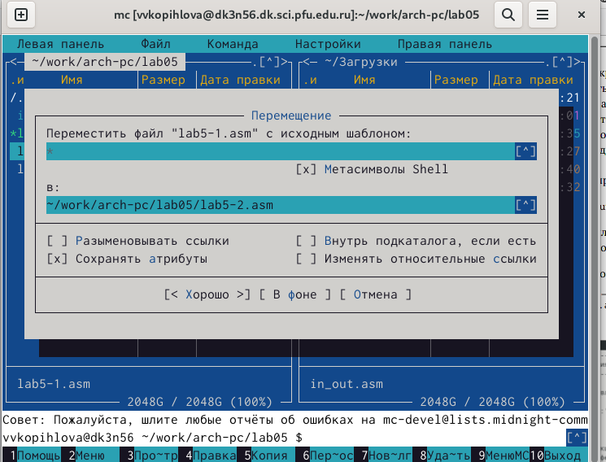{width=100%}

12. Исправьте текст программы в файле lab5-2.asm с использование подпрограмм из внешнего файла in_out.asm (используйте подпрограммы sprintLF, sread и quit) в соответствии с листингом 5.2. Создайте исполняемый файл и проверьте его работу (рис. 10 [-@fig:010]), (рис. 11 [-@fig:011]).

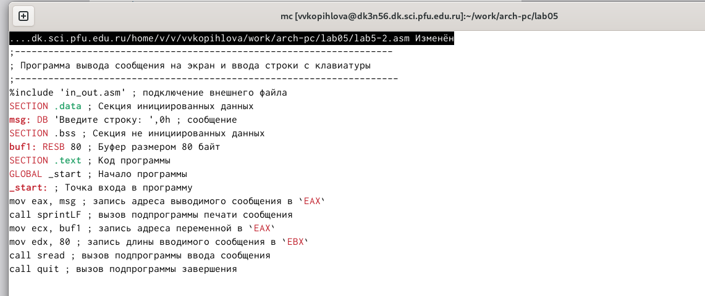{width=100%}

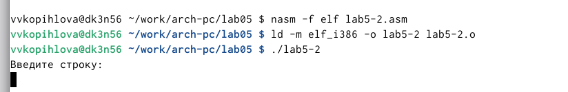{width=100%}

13. В файле lab5-2.asm замените подпрограмму sprintLF на sprint. Создайте исполняемый файл и проверьте его работу (рис. 12 [-@fig:012]).

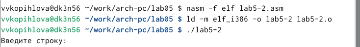{width=100%}

5.4. Задание для самостоятельной работы

1. Создайте копию файла lab5-1.asm. Внесите изменения в программу (без использования внешнего файла in_out.asm), так чтобы она работала по следующему алгоритму:
• вывести приглашение типа “Введите строку:”;
• ввести строку с клавиатуры;
• вывести введённую строку на экран.
2. Получите исполняемый файл и проверьте его работу. На приглашение ввести строку введите свою фамилию (рис. 13 [-@fig:013]), (рис. 14 [-@fig:014]).

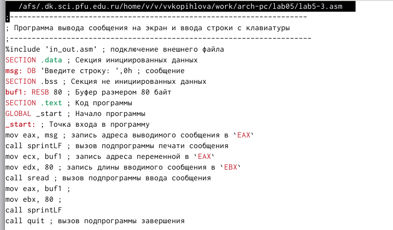{width=100%}

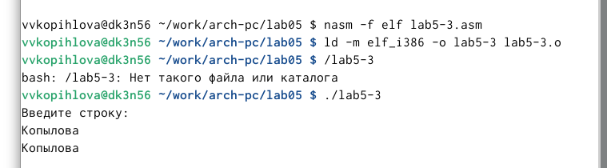{width=100%}

3. Создайте копию файла lab5-2.asm. Исправьте текст программы с использование подпрограмм из внешнего файла in_out.asm, так чтобы она работала по следующему алгоритму:
• вывести приглашение типа “Введите строку:”;
• ввести строку с клавиатуры;
• вывести введённую строку на экран.
4. Создайте исполняемый файл и проверьте его работу (рис. 15 [-@fig:015]).

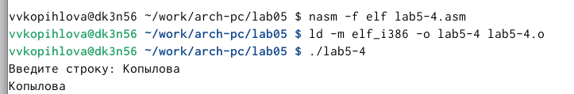{width=100%}

# Выводы

Я приобрела практические навыки работы в Midnight Commander и освоила инструкцию языка ассемблера mov и int.

# Список литературы{.unnumbered}

::: {#refs}
:::
